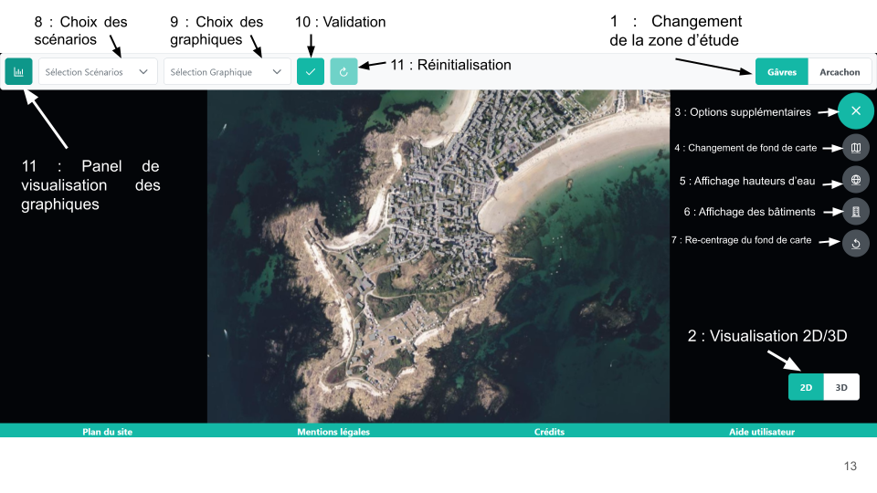

# PFA TSI 2022-2023 : ANR Oracles - VTTHREE : "Visualisation de scénarios de submersion côtière"

Manuel d'utilisation
=======

## Table des matières
1. [Informations](#Informations)
2. [Accès à l'application](#Accès-à-la-page-WEB)
3. [Fonctionnalités de l'application](#Fonctionnalités)

***
# Informations
###### Authors and acknowledgment
Ilona Baran, Léa Fredoc, Jacqueline Williams & Fernando Rico Quintero
###### Commanditaires
Sidonie Christophe et Jacques Gautier
###### Project status
Development & Maintenance will cease on 28/04/2023
###### URL du site
localhost:8082
###### Pré-requis
+ Connection internet pour l'affichage de la carte  
+ Utilisation d'un navigateur

***
# Accès à la page web
Pour accéder à la page web, il vous suffit de rentrer l’URL du site dans n’importe quel navigateur web, de préférence Mozilla Firefox car c’est le navigateur utilisé pour son développement.

***
# Fonctionnalités 
L'application est composée :
+ d'un pied de page (espace des options de la page (aide, crédits, plan du site, etc)) ;
+ d'une en-tête permettant le choix de la zone d'étude ainsi que les scénarios et graphiques à visualiser
+ d'un fond de carte au milieu et d'un bouton permettant de visualiser la scène et 2D ou 3D
+ d'un widget sur la droite proposant plusieurs options pour l'utilisateur (changement du fond de carte, visualisation des bâtiments...)

L'image ci-dessous montre la page de l'application. Les numéros sur cette capture sont détaillés dans les points suivants. 

**
## Changement de la zone d'étude (Numéro 1)
Dans l'en-tête de la page à droite, vous toruverez deux boutons 'Gâvres' et 'Arcachon'. Pour changer de zone d'étude, vous devez cliquer sur la zone que vous souhaitez.
Dans ce prototype, nous n'avons pas de données pour Arcachon, ce bouton est donc désactivé.

**
## Visualisation en 2D et 3D (Numéro 2)
Dans la partie principale de l'applicaiton, vous trouverez en bas à droite deux boutons '2D' et '3D'. La vue sur laquelle vous êtes en en vert. Pour changer de dimension, vous devez simplement cliquer sur la dimension voulue.
-->  rajouter comment naviguer en 2D ET 3D

**
## Autres options (Numéro 3)
A droite, dans la partie principale, vous trouverez un bouton vert +. Lorsque vous cliquez dessus, plusieurs icônes apparaissent :
+ Changement de fond de carte (Numéro 4)
+ Affichage des hauteurs d'eau maximale et finale (Numéro 5) (cette partie est détaillée dans une prochaine section)
+ Affichage ou supression des bâtiments (Numéro 6)
+ Recentrer la vue (Numéro 7)

**
## Visualisation des graphiques
Pour visualiser un graphique, il vous suffit de choisir un ou plusieurs scénarios dans l'en-tête de la page. (Numéro 8)
Ensuite, vous devez choisir un graphique parmi ceux proposés et valider votre séléction. (Numéro 9 - Numéro 10)
Sur la gauche, un panel s'ouvrira avec le graphique que vous avez choisi. (Numéro 10)

Si vous voulez changer de graphique, vous pouvez le faire en choississant un autre graphique.
Si vous voulez modifier les graphiques séléctionnés, vous devez cliquer sur le bouton de réinitialisation. (Numéro 11)

#### Diagramme 1 : Diagramme linéaire
Quatre graphiques sont affichés : la hauteur des vagues, la surcote, la vitesse du vent en fonction du temps
Il est possible de séléctionner un ou plusieurs scénarios.

#### Diagramme 2 : Rose des vents
Ce graphique présente la distribution de la vitesse du vent pour une simulation.
Les données pour une même simulation sont très proches en terme :
+ de vitesse de vent (écart d’environ 3 m/s entre la valeur minimale et maximale) ;
+ de direction du vent (écart d’environ 10° entre la valeur minimale et maximale). 
Il peut donc être difficle d'obtenir un résultat exploitable.

#### Diagramme 3 : Histogramme empilé
Quatre graphiques sont affichés : la hauteur des vagues, la surcote, la vitesse du vent en fonction du temps
Il est possible de séléctionner un ou plusieurs scénarios.

#### Diagramme 4 : Carte de chaleur
La carte de chaleur montre la hauteur de l'eau en fonction du temps. 
Il est possible de séléctionner un ou plusieurs scénarios.

#### Diagramme 5 : Linéaire 3D
La carte de chaleur peut être difficilement exploitable car les valeurs au sein d'un même scénario varient peu. Pour avoir une autre représentation, nous avons réalisé ce diagramme 3D. 
Il est possible de séléctionner un ou plusieurs scénarios.

**
## Affichage des hauteurs d'eau maximale et finale (Numéro 5)
Pour pouvoir visualiser ces hauteurs d'eau, vous devez au préalable séléctionner des scénarios dans l'en-tête de la page, à l'endroit où vous les séléctionnez pour les graphiques. Vous aurez comme possibilité de séléctionner les hauteurs d'eau maximale et finale des graphiques séléctionnées uniquement. 

#### Pour un scénario
Vous séléctionnez le scénario voulu et le type de hauteur d'eau que vous voulez visualiser : hmax pour la hauteur d'eau finale et hfin pour la hauteur d'eau finale. Après validation, vous verrez cette hauteur d'eau apparaître sur la carte. Le chargement peut prendre quelques instants.

#### Pour plusieurs scénarios
Vous séléctionnez les scénarios voulus. Vous devez ensuite choisir parmi trois options : 
+ moy : vous choisissez de visualiser la moyenne des hauteurs d'eau des scénarios
+ min : vous choisissez de visualiser la hauteur minimale d'eau des scénarios
+ max : vous choisissez de visualiser la hauteur maximale d'eau des scénarios

Ensuite, vous choisissez le type de hauteur d'eau que vous voulez visualiser : hmax pour la hauteur d'eau finale et hfin pour la hauteur d'eau finale. Après validation, vous verrez cette hauteur d'eau apparaître sur la carte. Le chargement peut prendre quelques instants.
